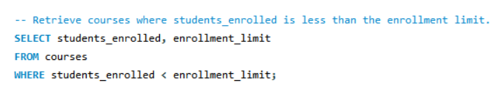
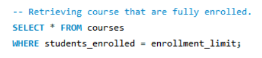

# Final-Lab-Task-3.1

In this activity, we utilize the usage of MySQL clauses to interact with a database by retrieving, organizing, and analyzing data from a structured table. By following the guide below:

- **Task 1**:
In this task, we are able to utilize the SELECT and WHERE clauses to retrieve all courses where the number of students_enrolled is less than the enrollment_limit.

- **Task 2**:
In this task, we are able to utilize the SELECT, GROUP BY, and SUM functions to group courses by category and calculate the total number of enrolled students in each.

- **Task 3**:
In this task, we are able to utilize the SELECT and WHERE clauses to retrieve courses where students_enrolled is equal to enrollment_limit, indicating full enrollment.

- **Task 4**:
In this task, we are able to utilize the SELECT and SUM function to calculate the total number of students enrolled across all courses.

- **Task 5**:
In this task, we are able to utilize the SELECT and ORDER BY clauses to sort the courses in ascending order based on students_enrolled.

# Query Statements

- **Task 1**

- **Task 2**

- **Task 3**

- **Task 4**

- **Task 5**

#  Table Structure

- **Task 1**

- **Task 2**

- **Task 3**

- **Task 4**

- **Task 5**

